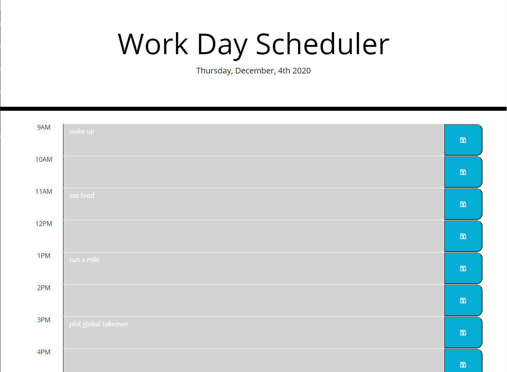

# day-planner

This assignment is a day planner to create a schedule. When I open the planner the current day is displayed at the top of the calendar. When I scroll down, I am presented with time blocks for that day. I view the time blocks for that day and each time block is color-coded to indicate whether it is in the past, present, or future. When I click into a time block, I can enter an event. I can click the save button for that time block. The text for that event is saved in local storage. When I refresh the page, the saved events persist.

## Credits

Special shoutout to Jeana Rose Mathis and Spencer Vaughan for help with this homework. Here is the [link](https://github.com/jeanarose) to her GitHub and the [link](https://github.com/spencerv86) to his GitHub.

## Screenshot

## link to website

https://itsjustikenna.github.io/day-planner/

